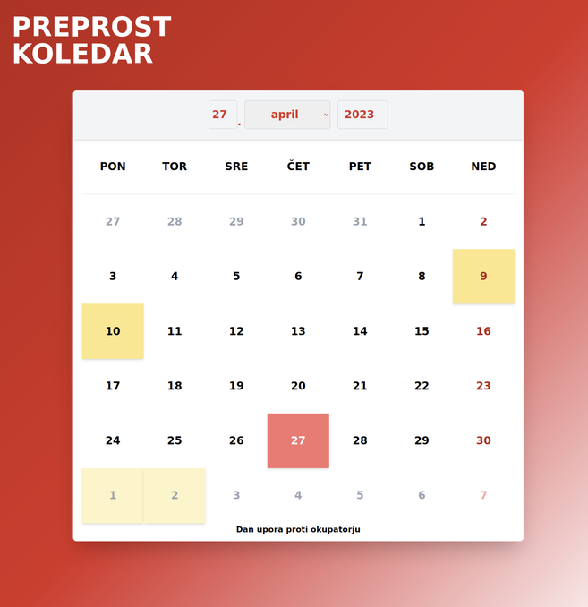

# Simple Calendar



### [Live Demo](https://jernejvivod.github.io/simple-calendar/)

This is a simple calendar app that allows users to view and select days, as well as see holidays and their names. It currently supports 
Slovenian holidays. The repeating holidays are visible for all years, while the changing holidays are only available for the year 2023.

The API for holiday retrieval for the live demo is hosted using Google Cloud Platform.

## Running the Application Locally

To get started with running this app locally, clone the repository using the following command:
```bash
git clone https://github.com/jernejvivod/simple-calendar.git
```

To run the application, navigate to the project directory and run the following command:

```bash
docker-compose up
```
This command will start the application and its dependencies in Docker containers. Once the containers are up and running, you can access the app at `http://localhost:4200/`.
